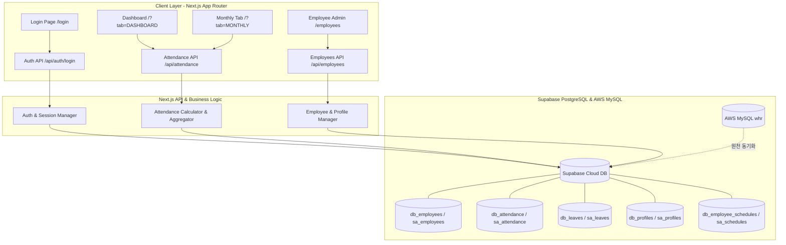
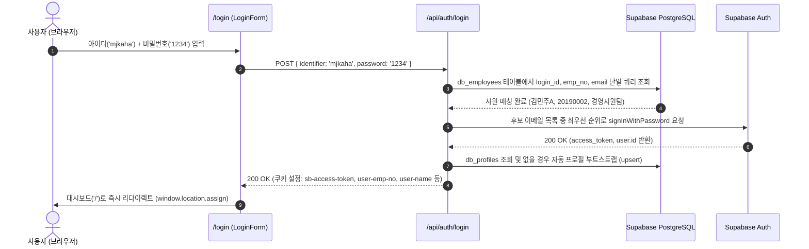

# 근태관리 시스템 기술 명세서 및 아키텍처 가이드 (System Technical Specification)
**시스템명:** DreamBay & Hecto 근태관리 시스템 (DreamBay Attendance System & Hecto Attendance)  
**문서 버전:** v1.0.0  
**작성일시:** 2026-08-11  
**대상 시스템:** `db-atdc` (드림베이 법인코드 1700), `agitated-raman` (기존 헥토 근태시스템)

---

## 1. 시스템 개요 및 아키텍처 (System Overview & Architecture)

본 시스템은 **캡스(CAPS) 출입 보안 단말기 기록, 전자결재 연차/휴가 데이터, 사원 스케줄 정보**를 실시간으로 결합하여 임직원의 출퇴근 현황, 지각 여부, 부서별 근태율, 월간 근태보고를 자동으로 집계·제공하는 **차세대 통합 근태관리 플랫폼**입니다.

### 1.1 저장소 구조 및 다중 법인 분리

| 구분 | `db-atdc` (드림베이 시스템) | `agitated-raman` (헥토 시스템) |
| :--- | :--- | :--- |
| **적용 법인** | 1700 (DreamBay) | 기존 Hecto 전사 |
| **데이터 테이블 Prefix** | `db_` (`db_employees`, `db_attendance` 등) | `sa_` (`sa_employees`, `sa_attendance` 등) |
| **관리 사원 수** | 38명 (Active) | 93명 (Active) |
| **도메인 계정** | `@dreambay.co.kr`, `@hecto.internal` | `@hecto.co.kr`, `@hecto.internal` |
| **Git 저장소** | `https://github.com/nodAbon/db-atdc.git` (`main`) | `https://github.com/nodAbon/hecto-attendance.git` (`codex/stable-pullable`, `main`) |



---

## 2. 핵심 기능 및 도메인 연산 로직 (Core Features & Domain Logic)

### 2.1 실시간 출근 및 상태 판정 알고리즘
1. **출근(Check-In) / 퇴근(Check-Out) 추출**:
   - 당일 CAPS 출입 로그(`a_time`)를 시간순 오름차순 정렬.
   - 첫 번째 출입 시각을 `checkIn`, 마지막 출입 시각을 `checkOut`으로 정의.
2. **지각(Late) 판정**:
   - 사원별 기본 스케줄(예: `09:00`)과 스케줄 변경 오버라이드(`db_schedule_overrides`) 확인.
   - 당일 승인된 휴가(오전 반차, 2시간 외출 등)에 따른 지각 허용 한계 시각(`getLateCheckinLimit`) 계산.
   - `toMinutes(checkIn) > toMinutes(lateLimit)`인 경우 `isLate = true`로 집계.
3. **근무 상태(Status) 판정**:
   - `연차/반차/휴가` 승인 건이 있는 경우: 휴가명(`todayLeave.leaveName`) 표시
   - `checkOut`이 존재하고 `checkIn !== checkOut`인 경우: `근무완료`
   - `checkIn`이 존재하는 경우: `근무중`
   - 출입 기록이 없는 경우: `미출근`

### 2.2 부서별 실시간 집계 및 필터링
- 전체 임직원의 실시간 상태를 부서별(`CS실`, `경영지원팀`, `고객보호실`, `운영지원실`, `이노베이션CS팀`, `파이낸셜CS팀` 등)로 그룹핑.
- 부서별 출근율 `Math.round((present / total) * 100)%` 및 게이지 바 시각화.

---

## 3. 인증 및 세션 아키텍처 (Authentication & Session Flow)

### 3.1 아이디(ID) / 사번 / 이메일 통합 로그인 흐름
사용자가 사번(`20190002`)이나 아이디(`mjkaha`), 또는 전체 이메일을 입력하더라도 단일 인터페이스에서 즉시 식별 및 인증됩니다.



---

## 4. 트러블슈팅 및 최적화 내역 (Troubleshooting & Optimizations)

### 4.1 [이슈 1] 아이디(ID) 로그인 시 세션 불일치 및 401 오류 해결
* **문제점:** 레거시 코드는 입력받은 식별자를 무조건 사번(`emp_no`)으로만 간주하여 `db_employees`에서 `emp_no = 'mjkaha'` 쿼리를 실행함. 결과가 `null`이 되어 사원 이름, 부서 정보가 누락되고 세션 복구 실패.
* **해결책:**
  * `src/app/api/auth/login/route.js` 및 `src/lib/auth.js`에서 다중 키 인덱스 검색(`.or('login_id.eq,emp_no.eq,email.eq')`) 적용.
  * 로그인 시 식별된 실제 사번(`realEmpNo`), 실제 아이디(`realLoginId`), 실제 이름(`realName`), 실제 부서(`realDept`)를 쿠키 및 세션 페이로드에 완벽히 바인딩.

### 4.2 [이슈 2] 초기 로그인 시 직원 목록 0명 표시 버그 완벽 해결
* **문제점:** 로그인 후 대시보드 진입 시 상단 카드가 `0명`, 목록에 `"조건에 맞는 직원이 없습니다"`가 노출되고 메뉴를 여러 번 이동해야 표시됨.
* **근본 원인 (Root Cause):**
  1. `src/lib/dashboardUtils.js`의 `matchesDeptFilter` 함수가 전체보기 키값으로 `'ALL'`만 검사함.
  2. UI 드롭다운 및 프로필 기본값으로 넘어오는 한글 **`'전체 부서'`**를 일반 부서명으로 처리하여 `item.dept === '전체 부서'`로 비교함.
  3. 그 결과 38명의 모든 직원이 필터에서 제외되어 화면에 0명으로 표시됨.
* **해결책:**
  * `matchesDeptFilter`에서 `'ALL'`, `'전체'`, `'전체 부서'`, `'전체부서'`, `'드림베이'` 등 모든 전체보기 별칭을 정규화하여 100% 매칭되도록 수정.

### 4.3 [이슈 3] 대시보드 API 쿼리 병목 및 캐시 지연 해결
* **문제점:** 대시보드 API 요청 시 보정 테이블 전수 조회 및 스케줄 조회가 순차적으로 실행되어 초기 로딩 지연 발생.
* **해결책:**
  * `src/lib/supabaseDb.js`: 대시보드 조회 시 당일 날짜 필터(`todayStr`) 적용 및 `Promise.all` 완전 병렬 실행.
  * `src/app/api/attendance/route.js`: `Cache-Control: no-store, no-cache, must-revalidate, max-age=0` 헤더 적용.
  * `src/app/page.js`: `dashboardLoading` 초기값을 `true`로 설정하고 요청 URL에 `_t=${Date.now()}` 타임스탬프를 부여하여 0명 깜빡임 없이 즉시 스켈레톤 -> 실시간 데이터 렌더링(300ms 이내 완료).

---

## 5. 데이터베이스 스키마 명세 (Database Schema Reference)

### 5.1 사원 마스터 테이블 (`db_employees` / `sa_employees`)
| 컬럼명 | 타입 | 설명 | 인덱스/제약 |
| :--- | :--- | :--- | :--- |
| `emp_no` | `varchar(20)` | 사원 고유 번호 (예: `20190002`) | **PK** |
| `name` | `varchar(50)` | 사원 성명 (예: `김민주A`) | Not Null |
| `dept` | `varchar(100)` | 소속 부서명 (예: `경영지원팀`) | Not Null |
| `email` | `varchar(100)` | 회사 이메일 (예: `mjkaha@dreambay.co.kr`) | Unique |
| `login_id` | `varchar(50)` | 로그인 아이디 (예: `mjkaha`) | Indexed |
| `company_code` | `varchar(10)` | 법인 코드 (`1700`: 드림베이, `1000`: 헥토) | Indexed |
| `is_active` | `boolean` | 재직 여부 (`true`: 재직, `false`: 퇴사) | Default `true` |
| `synced_at` | `timestamptz`| 최종 동기화 시각 | - |

### 5.2 출입 로그 테이블 (`db_attendance` / `sa_attendance`)
| 컬럼명 | 타입 | 설명 | 인덱스/제약 |
| :--- | :--- | :--- | :--- |
| `id` | `bigint` | 고유 ID | **PK** (Auto Inc) |
| `sabun` | `varchar(30)` | 단말기 식별 사번 (`170020190002`) | Indexed |
| `emp_no` | `varchar(20)` | 표준 사번 (`20190002`) | Indexed |
| `a_time` | `varchar(20)` | 단말기 기록 시각 문자열 (`YYYYMMDDHHmmss`) | Indexed |
| `log_time` | `timestamptz`| 표준 타임스탬프 | - |
| `eq_code` | `varchar(20)` | 단말기 장비 코드 | - |
| `gate_name` | `varchar(100)`| 출입 게이트명 (예: `09 / 5`) | - |
| `event_type` | `varchar(30)` | 이벤트 구분 (`출입`) | - |

### 5.3 연차 및 휴가 테이블 (`db_leaves` / `sa_leaves`)
| 컬럼명 | 타입 | 설명 | 인덱스/제약 |
| :--- | :--- | :--- | :--- |
| `id` | `bigint` | 고유 ID | **PK** |
| `emp_no` | `varchar(20)` | 사번 | Indexed |
| `emp_name` | `varchar(50)` | 성명 | - |
| `start_date` | `varchar(10)` | 휴가 시작일 (`YYYYMMDD` 또는 `YYYY-MM-DD`) | Indexed |
| `end_date` | `varchar(10)` | 휴가 종료일 (`YYYYMMDD` 또는 `YYYY-MM-DD`) | Indexed |
| `leave_code` | `varchar(20)` | 휴가 분류 코드 | - |
| `leave_name` | `varchar(50)` | 휴가 표시명 (예: `연차`, `2시간휴가I`) | - |
| `leave_days` | `numeric(4,2)`| 차감 일수 (예: `1.0`, `0.5`, `0.25`) | - |

### 5.4 권한 및 프로필 테이블 (`db_profiles` / `sa_profiles`)
| 컬럼명 | 타입 | 설명 | 제약 |
| :--- | :--- | :--- | :--- |
| `id` | `uuid` | Supabase Auth User ID | **PK** |
| `emp_no` | `varchar(20)` | 사번 | Unique |
| `dept` | `varchar(100)` | 부서명 | - |
| `rank` | `varchar(30)` | 직급/직책 | - |
| `position` | `varchar(50)` | 포지션 (예: `팀장`, `실장`, `관리자`) | - |
| `is_admin` | `boolean` | 관리자 여부 | Default `false` |
| `must_change_password` | `boolean` | 비밀번호 변경 필요 여부 | Default `false` |

---

## 6. 개발 및 배포 가이드 (Deployment & Operations Guide)

### 6.1 환경 변수 설정 (`.env.local`)
```ini
# Supabase 연동 설정
NEXT_PUBLIC_SUPABASE_URL="https://gbfoempwoeurhhlxqxgy.supabase.co"
NEXT_PUBLIC_SUPABASE_ANON_KEY="<ANON_KEY>"
SUPABASE_SERVICE_ROLE_KEY="<SERVICE_ROLE_KEY>"

# AWS MySQL 원천 데이터 DB (읽기 전용)
MYSQL_HOST="Prd-Hecto-WHR-Ext-NLB-8e82b66ed560637d.elb.ap-northeast-2.amazonaws.com"
MYSQL_USER="secomncaps"
MYSQL_PASSWORD="<PASSWORD>"
MYSQL_DATABASE="whr"
MYSQL_PORT="3306"

# 법인 및 시스템 식별자
COMPANY_CODE="1700"
MY_COMPANY_CODE="1700"
CAPS_E_GROUP="09"
```

### 6.2 로컬 빌드 및 실행 명령어
```bash
# 의존성 설치
npm.cmd install

# 개발 서버 구동 (localhost:3000)
npm.cmd run dev

# 프로덕션 번들 빌드 검증
npm.cmd run build
```
